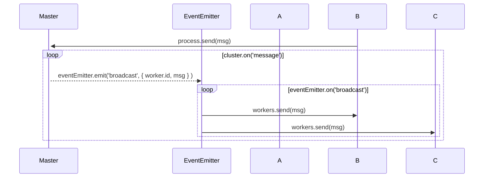

# Example of NodesJS Cluster

## Example 1: messages to cluster of children

1. Event Emitter is created in `Master` Process
2. Listener attached to cluster `cluster.on('message'...` will forward to Event Emitter
2. Worker `A`, `B`, and `C` are wired to send via `process.send(...` which `cluster.on('message'` is listening on
3. so when a message is sent `process.send(` the event listener `cluster.on('message'` picks up ans sends to Event Emitter
4. Event Emitter iterates through the workers and sends a message to all ( except the orgin )

## Example 2: respawn when dies

1. Workers are created, with a `process.env` dedicated to each process.
2. Each worker is tracked in a map ( object literal ), with the process id as the key
3. the Value is a touple that holds the worker and the `process.env`
4. The worker can exit abnormally, or die via an exception.
5. `cluster.on('exit',` traps any exit of children, looks up the touple in the worker map, and respawns the worker.

*TODO* would be nice to have signals in the workers that could detect and handle a os signal to shutodwn.
